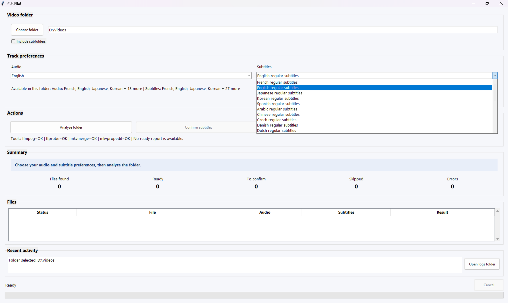
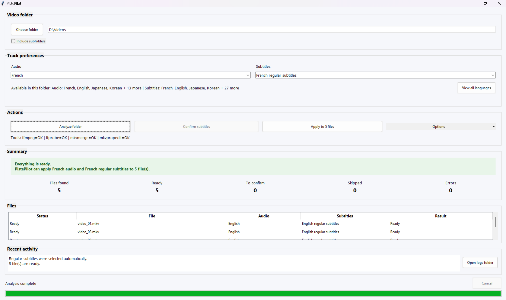
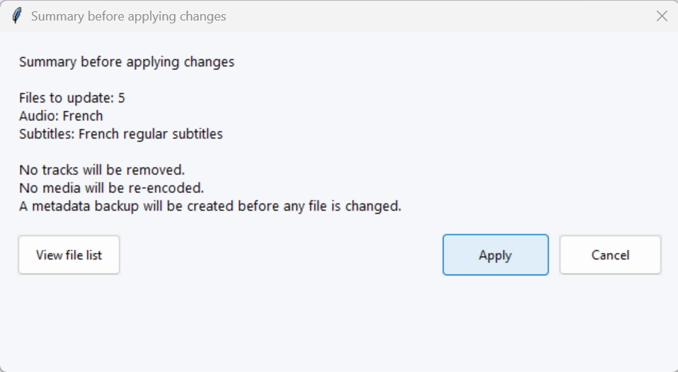

# PistePilot

Batch-select default audio and subtitle tracks for video files without re-encoding.

Current public beta: `v0.1.1-beta`

## Overview

PistePilot is a Windows-friendly GUI and CLI tool that scans video files, detects audio and subtitle tracks, and sets your preferred default tracks in batch.

It is designed for folders containing many video files with multiple audio and subtitle tracks, especially MKV libraries where manual default-track selection becomes repetitive.

## Features

- Batch-scan a folder of video files
- Select a preferred audio language
- Select regular subtitles while avoiding forced, SDH, commentary, and Dubtitle tracks
- Handles language aliases such as `fr`, `fre`, `fra`, `en`, `eng`, `es-ES`, `es-419`, and more
- Groups similar episodes or releases to avoid repetitive confirmations
- Updates MKV track flags without re-encoding
- Creates metadata backups before applying changes
- GUI and CLI available
- Portable Windows release support

## Safety

- No tracks are deleted
- No media is re-encoded
- Changes are applied to default and forced flags only
- A metadata backup is created before applying changes
- Processing continues even if one file fails
- Test on copies first

## Screenshots

### 1. Choose a folder and track preferences

Select a video folder, choose the preferred audio language, and review the available subtitle languages from the main window.



### 2. Review the analysis

After analysis, the summary confirms that the files are ready and shows the recommended audio and subtitle tracks.



### 3. Confirm before applying changes

Before modifying any file, PistePilot displays a confirmation dialog with the number of files, the selected tracks, and the safety guarantees.



## Requirements

- Windows 10 or Windows 11 for the main GUI workflow
- FFmpeg
- MKVToolNix
- Python 3.12+ for development

## Quick start — GUI

For an end-user release:

```powershell
.\PistePilot.exe
```

For development builds:

```powershell
.\build_exe.ps1 -Release
.\setup_dist_bins.ps1 -TargetDir ".\release\bin"
.\release\PistePilot.exe
```

## Developer setup

```powershell
py -3.12 -m venv .venv
.\.venv\Scripts\Activate.ps1
python -m pip install --upgrade pip
pip install -r requirements-dev.txt
python -m pytest
python -m pistepilot.gui
```

## Build

Developer build:

```powershell
.\build_exe.ps1
```

GUI-only build:

```powershell
.\build_exe.ps1 -GuiOnly
```

Release build:

```powershell
.\build_exe.ps1 -Release
.\setup_dist_bins.ps1 -TargetDir ".\release\bin"
```

Release build with automatic bin preparation:

```powershell
.\build_exe.ps1 -Release -SetupBins
```

## GUI and CLI

### GUI

```powershell
python -m pistepilot.gui
```

### CLI

```powershell
python -m pistepilot.cli --version
python -m pistepilot.cli tools
python -m pistepilot.cli analyze "D:\Videos\ExampleSeason" --audio fr --subs fr
python -m pistepilot.cli apply "D:\Videos\ExampleSeason" --audio fr --subs fr
python -m pistepilot.cli restore "<path-to-metadata-backup.json>"
```

At startup, the GUI does not restore the last folder automatically. The folder field starts empty, selectors stay disabled until a folder is chosen, and no previous report is shown.

## External tools

PistePilot relies on external tools:

- FFmpeg / `ffprobe`
- MKVToolNix / `mkvmerge` / `mkvpropedit`

These tools are not owned by PistePilot.
They are installed or copied separately by `setup_dist_bins.ps1`, or can be installed manually by the user.

PistePilot does not redistribute these tools in the source repository.

The source repository must stay lightweight:

- external binaries must not be committed
- generated logs and backups must not be committed
- release artifacts must not be committed

## setup_dist_bins.ps1

Use:

```powershell
.\setup_dist_bins.ps1
.\setup_dist_bins.ps1 -TargetDir ".\release\bin"
.\setup_dist_bins.ps1 -UseWinget
```

Behavior:

1. Search the current `PATH`
2. Copy executables if already available
3. If `-UseWinget` is provided, try installing FFmpeg and MKVToolNix via `winget`
4. Search again
5. Verify that these files are present:
   - `ffmpeg.exe`
   - `ffprobe.exe`
   - `mkvmerge.exe`
   - `mkvpropedit.exe`

## Portable release layout

```text
release/
├─ PistePilot.exe
├─ README.md
├─ LICENSE
└─ bin/
   ├─ ffmpeg.exe
   ├─ ffprobe.exe
   ├─ mkvmerge.exe
   └─ mkvpropedit.exe
```

## Troubleshooting

### Tools are missing

Run:

```powershell
.\setup_dist_bins.ps1
```

Or install FFmpeg and MKVToolNix manually, then copy the required executables into `bin/`.

### A file cannot be modified

Close video players, Plex, Jellyfin, file explorers, or anything that may lock the file, then try again.

### Antivirus warning

PyInstaller executables can sometimes trigger false positives. Build from source if you prefer.

### Logs

Logs are written to:

```text
logs/pistepilot_YYYYMMDD_HHMMSS.log
```

### Large libraries

- Start with copies
- Start with one season or one small folder
- Verify the result in VLC
- Only then process larger folders
- Do not open files while changes are being applied

## License

PistePilot is released under the MIT License.
